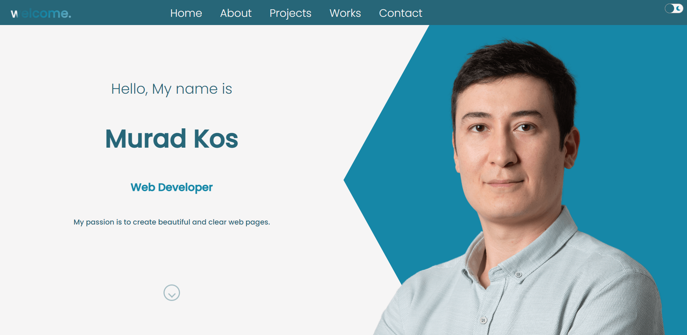

# Portfolio page

> This is my first portfolio page.
> Live demo [_here_](https://welcomeportfolio.netlify.app/).

## Table of Contents

- [General Info](#general-information)
- [Technologies Used](#technologies-used)
- [Features](#features)
- [Screenshots](#screenshots)
- [Setup](#setup)
- [Project Status](#project-status)
- [Room for Improvement](#room-for-improvement)
- [Acknowledgements](#acknowledgements)
- [Contact](#contact)
<!-- * [License](#license) -->

## General Information

- This is static portfolio page with information about me.
- The page has information about my skills and knowledge.
- You can find the information how to contact me.

## Technologies Used

<a href="https://reactjs.org/" target="_blank" rel="noreferrer">  </a> <a href="https://www.typescriptlang.org/" target="_blank" rel="noreferrer">  </a> <a href="https://sass-lang.com" target="_blank" rel="noreferrer">  </a>

## Features

- You can send me an email via contact form.

## Screenshots



<!-- If you have screenshots you'd like to share, include them here. -->

## Setup

Download the repo by using in your terminal `https://github.com/Murad-Git/portfolio_page`
then go to the main folder and start the project by

```
cd portfolio_page
npm i
# or
yarn install

npm run start
# or
yarn start
```

## Project Status

Project is: In progress

## Room for Improvement

Connection to GH API to extract the data automatically.

## Acknowledgements

- This project was inspired by [Lama Dev YT channel](https://www.youtube.com/watch?v=hQjlM-8C4Ps&list=PLU_BIhHhPljRUGv-vJfBkibYHuj18BJ_P&index=1&t=153s)

## Contact

Created by [Murad Kos](https://welcomeportfolio.netlify.app/) - feel free to contact me!
